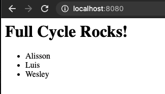
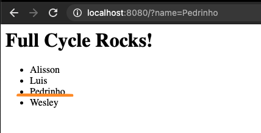

# Fullcycle :: Docker :: Desafio Node
## Subindo os serviços
```shell
docker-compose up -d
```

## Acessando o serviço
[http://localhost:8080](http://localhost:8080)

p.s.: verificar disponibilidade da porta no host

Resposta esperada:



## Adicionar registro no banco
[http://localhost:8080?name=Pedrinho](http://localhost:8080?name=Pedrinho)

Resposta esperada:

